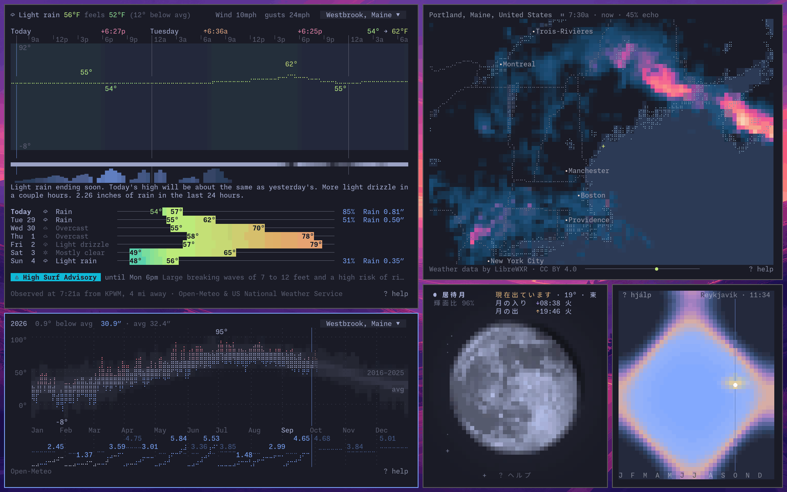
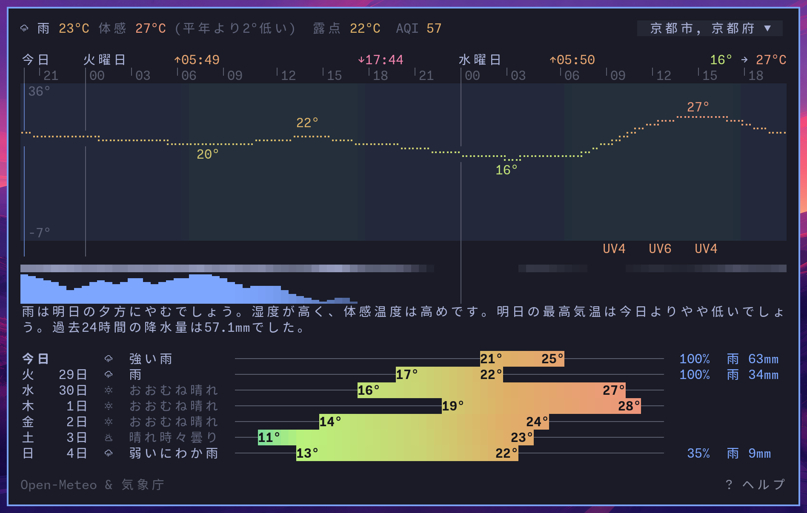
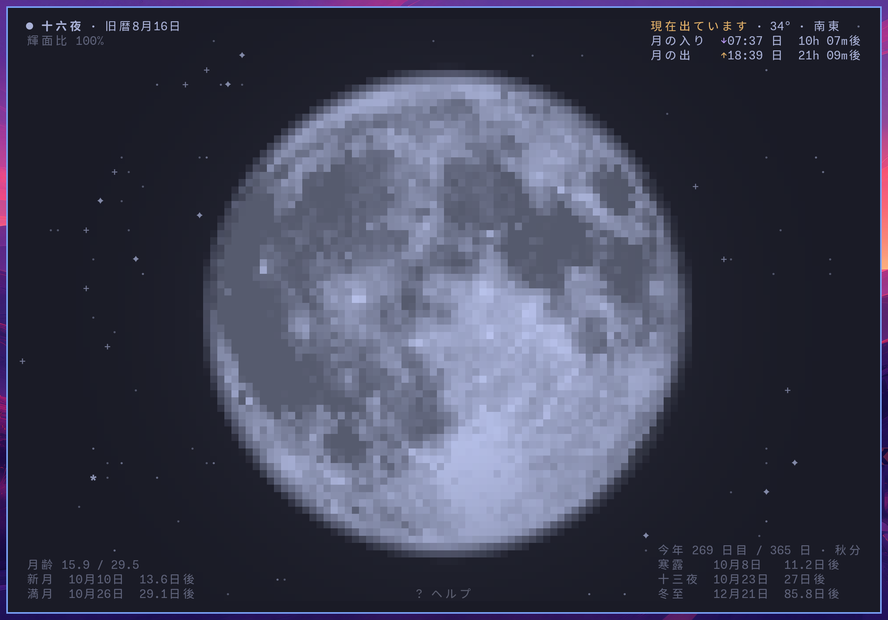
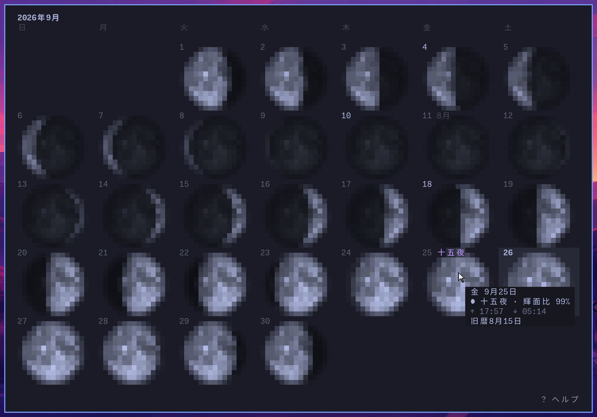
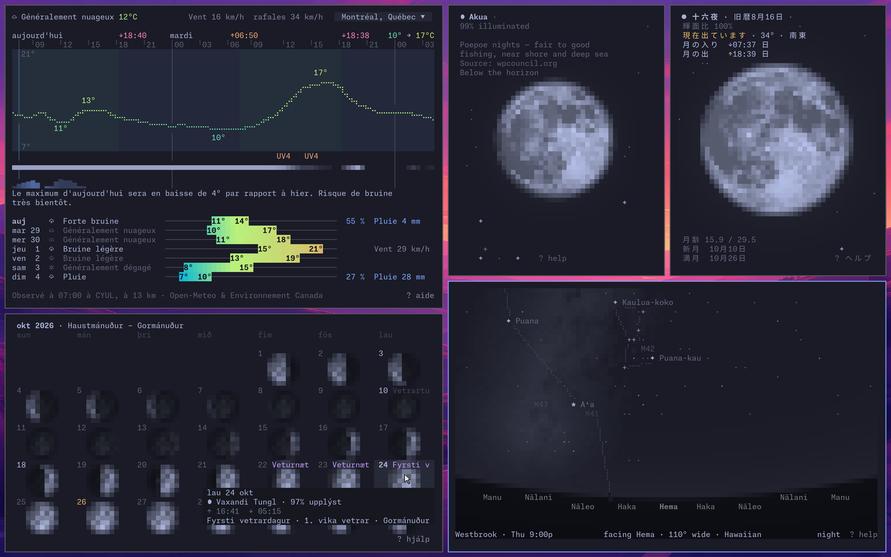
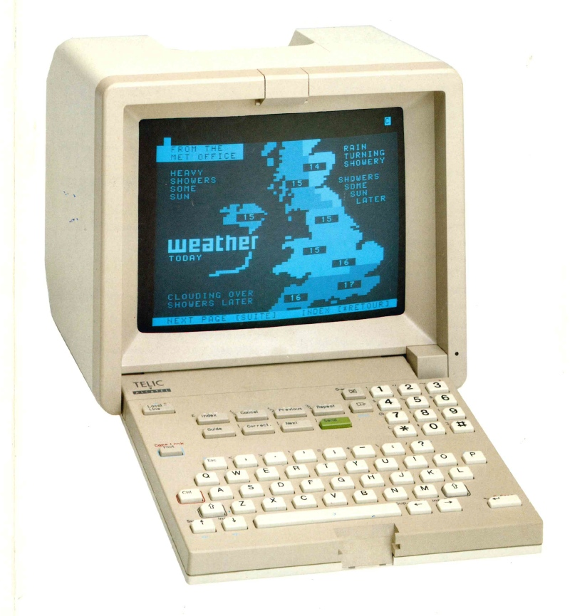

<div align="center">

# linecast

**天気、潮汐、太陽、月、地図、そしてプラネタリウムを、ターミナルで。『The Old Farmer's Almanac』とミニテルの出会い。**

[](https://github.com/ashuttl/linecast/actions/workflows/test.yml)
[](https://pypi.org/project/linecast/)
[](https://pypi.org/project/linecast/)
[](LICENSE)

<a href="https://terminaltrove.com/linecast/" title="linecast on Terminal Trove, the $HOME of all things in the terminal"></a>

[English](README.md) | 日本語

</div>

この日本語版は英語版READMEの要約です。全文と最新の内容は[英語版](README.md)にあります。


linecastは、無料で公開されているデータを、macOS・Linux・Windowsで動く7つのターミナルアプリで見せます。どれもリアルタイムに更新され、マウスでも操作できます。依存パッケージのない純粋なPythonで書かれ、色はターミナルのテーマに従い、アカウントもAPIキーも要りません。SSH越しでも、tmuxの中でも、ターミナルが動くところならどこでも動きます。

| コマンド | 表示するもの |
| --- | --- |
| `linecast weather` | 現在の天気、1時間ごとと7日間の予報、45か国の公式警報 |
| `linecast sunshine` | 今日の太陽が空を渡る軌跡と、一年を通じた昼の長さ |
| `linecast moon` | その場所から見た月。月の出と月の入りの時刻、次の満月と新月 |
| `linecast sky` | 今いる場所から見た空。夜には、ターミナルのプラネタリウムが星、星座、惑星、月、天の川を映します |
| `linecast tides` | 昼夜で陰影をつけた、スクロールできる潮汐曲線 |
| `linecast radar` | 世界中の気象レーダーをアニメーション表示。警報、気温、風も文字の升目に描きます |
| `linecast maps` | 街路地図、地形、そして今の昼夜と雲を映した回せる地球儀。地名検索と経路案内つき |

**[インストール](#インストール) · [使い方](#使い方) · [日本語で](#日本語で) · [設定](#設定) · [貢献するには](#貢献するには)**

## インストール

[Homebrew](https://brew.sh/)で:

```sh
brew install linecast
```

または[uv](https://docs.astral.sh/uv/)で:

```sh
uv tool install linecast
```

`pipx install linecast` と `pip install linecast` も使えます。コミュニティによるパッケージが[AUR](https://aur.archlinux.org/packages/linecast)と[nixpkgs](https://search.nixos.org/packages?channel=unstable&show=linecast)（今のところunstableチャンネル）にもあります。linecastにはPython 3.10以降が必要です。

何もインストールせずに試すには:

```sh
uvx linecast weather
```

curlだけでも動きます。[`get.sh`](get.sh)がマシンにあるPythonを探し、それでlinecastを実行します:

```sh
curl -sL https://raw.githubusercontent.com/ashuttl/linecast/main/get.sh | sh
```

これで `weather` が開きます。行末の `sh` を `sh -s sunshine` にすると別のツールが開き、`sh -s -- --metric` ならフラグを渡せます。

パッケージマネージャーが使えないときや、linecastをファイルとして持ち歩きたいときのために、各[リリース](https://github.com/ashuttl/linecast/releases/latest)にはlinecast全体を1つにまとめたファイル `linecast.pyz` も付いています。ただ、パッケージマネージャーが使えるならそちらをおすすめします。linecastを自動で最新に保ってくれるからです。このファイルは、新しいリリースが出たことを週に1回知らせるだけです。`chmod +x linecast.pyz` で実行できるようにしてから `./linecast.pyz weather` のように実行するか、名前を `linecast` に変えてPATHの通ったディレクトリに置いてください。Python 3.10以降が必要です。

<details>
<summary><strong>Windowsでは</strong></summary>

Windows Terminalを使ってください。Git Bashとminttyは、linecastからはターミナルではなくパイプに見えるため、静止した出力になります。Windowsではインストール時に2つのパッケージが加わります。Windowsに独自のタイムゾーンデータベースがないための `tzdata` と、TLSにWindowsが信頼する証明書を使わせるための `truststore` です。アイコンは絵文字ですが、Nerd Fontを設定していれば `linecast icons nerd` でフルセットに切り替わります。

</details>

## 使い方

どのコマンドも、[場所を保存する](#設定)までは、IPアドレスから推定した場所で開き、リアルタイムに更新されます。キー操作は `?` で表示されます。`weather` と `tides` では、地名をクリックするか `l` を押すと、最近の場所に切り替えたり、別の場所を検索したりできます。

コマンドをそのまま、あるいはフラグ付きで試してみてください:

```sh
linecast weather --location "kyoto"
linecast radar --location 44.35,-68.22
linecast sky --culture hawaiian --location molokai
linecast sunshine --year --location "vostok station"
linecast moon --lang zh
linecast tides --station "Burntcoat Head"
linecast maps --view terrain --location "new zealand"
linecast maps --from "477 congress street 04101" --to "portland head light" --profile bike
linecast maps --view now
```

`--print` を付けると、更新し続ける表示の代わりに静止した1フレームを出力します。weather、sunshine、moon、sky、tidesには、生データを出す `--json` と、ステータスバー用の `--oneline` もあります。

linecastは色をターミナルの配色から取ります。アプリを開いたまま配色を変えると、アプリは新しい色で描き直されます。これは同じデスクトップを、Omarchyの10のテーマで順に表示したものです:



各アプリのスクリーンショットは[英語版README](README.md#the-apps)に、それぞれのアプリのさまざまな状態は[docs/gallery.md](docs/gallery.md)にあります。

## 日本語で

ターミナルの言語が日本語なら、linecastは日本語で話します。そうでないときは、次のいずれかで日本語にできます:

```sh
linecast language ja            # 既定を日本語に
linecast weather --lang ja      # 今回だけ
export LINECAST_LANG=ja         # 環境変数で。保存した設定より優先されます
```

`weather` の警報は日本では気象庁から届き、画面の下の行にその名が出ます。`moon` は月相のとなりに旧暦の日付を添え、旧暦の日付に応じて、その夜を十六夜、立待月、居待月、寝待月、更待月などの名で呼び、今の二十四節気と、次の節気を迎える日、次の十五夜までの日数を示します。`v` を押すか、`--month` を付けて開くと、ひと月の月相が暦になり、十五夜などの行事がその日に記されます。`sunshine --hours japanese` は、常用時のとなりに江戸の不定時法で一日を読みます。

<p align="center">
  
  
</p>



## 設定

設定コマンドは、引数なしで現在の値を表示し、値を渡すと保存し、`auto` で既定に戻します。

| 設定 | 値 | 今回だけ |
| --- | --- | --- |
| `linecast location` | `set "Kyoto"`、`set 35.01,135.77`、`search 地名` | `--location` |
| `linecast language` | [31の言語](docs/languages.md)のいずれか | `--lang` |
| `linecast units` | `metric`、`imperial` | `--metric`、`--imperial` |
| `linecast clock` | `12`、`24` | `--12h`、`--24h` |
| `linecast week` | `monday`、`sunday`、`saturday` | `--week-start` |
| `linecast calendar` | `japanese`、`chinese`、`hebrew`、… | `--calendar` |
| `linecast culture` | `chinese`、`hawaiian`、`norse`、… | `--culture` |
| `linecast hours` | `japanese`、`halachic`、`roman`、… | `--hours` |
| `linecast icons` | `nerd`、`emoji`、`plain` | `--icons` |
| `linecast dates` | `gregorian`、`solar-hijri` | |
| `linecast digits` | `latin`、`native` | |

ほかの言語や伝統で見たアプリ。モントリオールの天気はカナダのフランス語で、レイキャビクの10月はアイスランドの暦で、ヒロの月はハワイの暦で、沖縄の月は日本語で、1月の空はハワイの星の名前と、地平線に沿ったスター・コンパスで表示しています:



場所を保存しないと、linecastはIPアドレスから場所を推定します。VPNやSSH越しでは大きくずれることがあります。

ペルシア語のサポートは試験的です。Ghostty、Alacritty、footでは動きますが、macOSのターミナルとiTerm2ではうまく表示されません。詳しくは[docs/languages.md](docs/languages.md#persian-and-right-to-left-text)をご覧ください。

暦は[docs/calendars.md](docs/calendars.md)、時刻法は[docs/hours.md](docs/hours.md)、星空の伝統は[docs/cultures.md](docs/cultures.md)、環境変数は[docs/configuration.md](docs/configuration.md)、データの出典とクレジットは[docs/sources.md](docs/sources.md)にあります（いずれも英語）。

## 貢献するには

質問、要望、アイデアは[Discussions](https://github.com/ashuttl/linecast/discussions)へ。プルリクエストも歓迎です。どんな変更が合うか、どのブランチから始めるか、テストの実行方法は[CONTRIBUTING.md](CONTRIBUTING.md)（英語）にあります。この日本語訳への修正も歓迎します。

## 系譜

<p align="center">
  
</p>

<p align="center"><em>先行技術。</em></p>

Telic-Alcatelのビデオテックス端末が天気を描いています。1990年ごろ。写真は[minitel-alcatel.fr](https://www.minitel-alcatel.fr/)の収蔵品から。

## ライセンス

[MIT](LICENSE)
