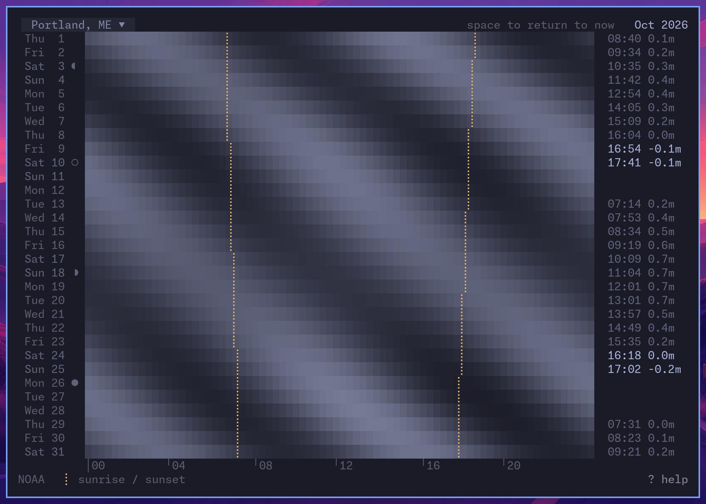

# About the tides

`linecast tides` has a month view. Each day is a row, the twenty-four hours run across, and the water is drawn light where it is high and dark where it is low. Portland, Maine draws the picture most people would expect: two bands of high water a day, each a little later than the day before. Hong Kong and Tokyo do not. Their bands break off, change places, or fade into one. This page explains why, using those three places in October 2026.

*Claude, Anthropic's AI model, wrote this page at Andrew's request, after a conversation in which he asked why Hong Kong's month looked the way it did. The figures were computed for the page with linecast's own code. How they were made, and the sources for everything else, are at the end.*

## Three Octobers

Portland, Maine. High water comes twice a day, and about fifty minutes later each day, so the light bands slant down the month. They are a little stronger around the new moon on the 10th and the full moon on the 26th. Nothing else changes.

Quarry Bay, Hong Kong. In the first week there is one broad high water and one broad low water a day. Around the 10th the picture changes to two tides a day. When the single broad band returns in the middle of the month, it is high water at the hours where low water was before.

Tokyo. There are two tides a day around the new moon and the full moon. Near the quarter moons, on the 3rd and the 19th, the two bands fade and one broad band is left.

In all three, the dotted lines are sunrise and sunset, and the times at the right are each day's lowest low water that falls in daylight.

## Two tides at once

The Moon's pull is a little stronger on the side of the Earth nearest to it than at the Earth's centre, and a little weaker on the far side. Compared with the Earth as a whole, the water on the near side is drawn toward the Moon and the water on the far side is left behind. The result is two bulges of water, one under the Moon and one opposite it.

The Earth turns under both bulges, so a place has two high waters in the time the Moon takes to come back overhead. That time is 24 hours and 50 minutes, a little more than a day, because the Moon moves along its orbit while the Earth turns. High waters are therefore 12 hours and 25 minutes apart, and each day's are about 50 minutes later than the day before. This is the twice-a-day tide. Oceanographers call it semidiurnal.

The Moon is usually not over the equator. In the course of a month it swings north of the equator and then south of it, and the two bulges swing with it, so that one is centred north of the equator and the other south. A place in the northern hemisphere then passes close to one bulge and far from the other, and one of its two high waters is higher than the other. An uneven pair of tides is the same thing as an even pair with a once-a-day tide added to it. This once-a-day tide, the diurnal tide, comes from the Moon standing away from the equator. How far north or south of the equator it stands is called its declination. When the Moon is over the equator there is none.

The Sun raises both kinds of tide in the same way. Its pull on the tides is a little under half the Moon's, and its tides keep the Sun's time: one comes exactly twice a day and the other exactly once.

Every tide is a sum of these parts, in proportions that differ from place to place. A place's tide is usually described as a list of constituents, each one a steady wave with its own period. The largest have names. M2 is the Moon's twice-a-day tide and S2 is the Sun's. N2 is the change in the Moon's tide as the Moon comes nearer and goes farther on its oval orbit. K1, O1 and P1 between them are the once-a-day tides of the Moon's declination and the Sun's. Grouped by cause, the three places look like this. Each figure is an amplitude in metres, which is half the swing between high and low water.

| | Portland | Tokyo | Quarry Bay |
|---|---|---|---|
| **Twice a day** | | | |
| The Moon (M2) | 1.38 | 0.48 | 0.38 |
| The Sun (S2) | 0.21 | 0.24 | 0.15 |
| The Moon's distance (N2) | 0.30 | 0.07 | 0.08 |
| **Once a day** | | | |
| The Moon's declination (O1 and part of K1) | 0.21 | 0.37 | 0.53 |
| The Sun's declination (P1 and part of K1) | 0.10 | 0.16 | 0.23 |
| **Form ratio** | 0.16 | 0.63 | 1.22 |

The last row is the usual measure of a tide's character. The form ratio is the two main once-a-day constituents divided by the two main twice-a-day ones, (K1 + O1) / (M2 + S2). Below 0.25 a tide is called semidiurnal. From 0.25 to 1.5 it is mixed and mainly semidiurnal, from 1.5 to 3 it is mixed and mainly diurnal, and above 3 it is diurnal. Portland's tide is almost purely twice a day. In Hong Kong the once-a-day part is the larger of the two.

## Springs, neaps, and the Moon's distance

The Moon's twice-a-day tide repeats every 12 hours and 25 minutes, and the Sun's every 12 hours. The two drift in and out of step and are back in step every 14.8 days. At the new moon and the full moon the Sun's high water falls on the Moon's, and the two add up to spring tides. At the quarter moons the Sun's high water falls on the Moon's low water and takes away from it, and those are neap tides. Springs arrive after the new or full moon, not on it, usually by about two days. The delay is called the age of the tide.

How different springs are from neaps depends on how large the Sun's part is beside the Moon's. In Tokyo it is half as large. The twice-a-day tide there had an amplitude of 0.75 m on October 11, the day of the new moon, and 0.16 m on October 19, the day of the first quarter. In Portland the Sun's part is a seventh of the Moon's, and the change from springs to neaps is gentle.

The Moon's orbit is an ellipse. At perigee, its nearest point, the Moon is about a tenth closer than at its farthest, and its pull on the tides is about 40% stronger, since that pull falls off with the cube of the distance. Perigee comes round every 27.6 days. In Portland this counts for more than the Sun does: the constituent for the Moon's distance is 0.30 m against the Sun's 0.21 m. The largest tides in Maine come when a perigee falls near a new or full moon. These are the perigean spring tides, often called king tides.

## Why Hong Kong's bands break

The two main once-a-day constituents are K1, with a period of 23.93 hours, and O1, with a period of 25.82 hours. Added together they make one wave whose period is 24 hours and 50 minutes, the same lunar day the twice-a-day tide keeps. The size of that wave swells and shrinks over 13.66 days, which is half the time the Moon takes to go from north to south and back.

The size passes through zero about a day after the Moon crosses the equator. When the wave comes back, it comes back upside down. The Moon is now on the other side of the equator, the bulges are tilted the other way, and the hour that had the high water now has the low. Here are the days around the Moon's crossing on October 9 at Quarry Bay, with the amplitude of each part and the time of the once-a-day part's high water.

| | Once a day | Its high water | Twice a day |
|---|---|---|---|
| October 8 | 0.33 m | 04:10 | 0.49 m |
| October 9 | 0.16 m | 05:10 | 0.54 m |
| October 10 | 0.05 m | | 0.56 m |
| October 11 | 0.18 m | 18:50 | 0.56 m |
| October 12 | 0.33 m | 19:40 | 0.54 m |

The once-a-day high water had been coming an hour later each day and was due at about seven in the morning on the 11th. It came at ten to seven in the evening, twelve hours away. In the month view, this is the band of low water that stops and is replaced by a band of high water at the same hours. The twice-a-day tide goes on underneath without a break, and for a few days around the 10th it is all there is.

Portland's once-a-day tide does the same thing on the same days. But its amplitude that month is between 3 and 26 cm, beside a twice-a-day tide of 1 to 1.7 m. All it decides is which of the day's two high waters is slightly the higher.

Two things made October 2026 an especially clear example.

The first is that the Sun's once-a-day tide was nearly absent. It comes from the Sun's declination, so it is largest at the solstices and gone at the equinoxes, and October begins a week after one. In December 2026 the Sun's part is at full strength. The once-a-day tide at Quarry Bay never falls below 0.16 m that month, its high water stays between five in the afternoon and the small hours, and the bands bend where October's break.

The second is that the spring tides and the Moon's crossings of the equator came together. Near an equinox the Sun is over the equator, so a new moon, which is in line with the Sun, and a full moon, which is opposite it, are near the equator too. The once-a-day tide therefore vanished just as the spring tides arrived, which left two clean tides a day around the 10th and the 25th. It was largest near the quarter moons, when the twice-a-day tide was at neaps, which left close to one tide a day around the 3rd and the 17th. At a solstice it is the other way round. New and full moons come when the Moon is far north or south, and the spring tides and the largest once-a-day tides arrive together. On December 25, 2026, the day after a full moon, the twice-a-day part at Quarry Bay is 0.58 m and the once-a-day part is 0.91 m. Both are the largest of the month, on the same day.

## Tokyo

Tokyo's tide is also mixed, with a form ratio of 0.63, and its once-a-day part also vanished around October 9 and 24. Its bands do not break as Hong Kong's do, because at those dates the twice-a-day tide was at springs and much the larger of the two.

What sets Tokyo apart is the Sun. Because the Sun's twice-a-day tide is half the size of the Moon's, the twice-a-day tide nearly cancels at neaps.

| | Twice a day | Once a day |
|---|---|---|
| October 11, new moon | 0.75 m | 0.24 m |
| October 15 | 0.56 m | 0.40 m |
| October 19, first quarter | 0.16 m | 0.34 m |
| October 22 | 0.44 m | 0.17 m |
| October 26, full moon | 0.77 m | 0.31 m |

For a few days around each quarter moon the once-a-day part is the larger, and Tokyo has close to one tide a day. Then the twice-a-day tide grows again and the single band splits back into two.

## The sea does most of the work

It is possible to work out what the tide would be if the ocean simply took the shape the Moon and the Sun pull it toward. This is called the equilibrium tide, and it depends only on latitude. The twice-a-day pull is strongest at the equator and falls to nothing at the poles. The once-a-day pull is nothing at the equator and at the poles, and strongest at 45°.

| | Portland, 44° N | Tokyo, 36° N | Quarry Bay, 22° N |
|---|---|---|---|
| The Moon twice a day (M2), from the sky alone | 0.13 m | 0.16 m | 0.21 m |
| As measured | 1.38 m | 0.48 m | 0.38 m |
| The sea's gain | 11 | 3 | 1.8 |
| The Moon once a day (O1), from the sky alone | 0.10 m | 0.10 m | 0.07 m |
| As measured | 0.11 m | 0.20 m | 0.29 m |
| The sea's gain | 1.1 | 2.1 | 4.1 |
| Form ratio from the sky alone | 1.30 | 0.98 | 0.56 |
| Form ratio as measured | 0.16 | 0.63 | 1.22 |

From the sky alone, Portland would have the mixed tide and Hong Kong the one that is mostly twice a day. The real tides are the other way round. The Moon's own twice-a-day pull at Portland amounts to 13 cm of water. The measured tide is eleven times that.

The reason is resonance. A body of water has natural periods at which it sloshes back and forth, set by its length and its depth, as the water in a bath has. A push repeated at close to that period builds up. A push at some other period mostly cancels itself.

The Gulf of Maine and the Bay of Fundy together have a natural period of about 13.3 hours, close to the Moon's 12 hours and 25 minutes. The Sun's 12 hours is a little farther from it, and at Portland the sea's gain on the Sun's twice-a-day tide is 3.5, against 11 on the Moon's. The once-a-day tides are nowhere near the natural period, and they arrive at about the size the sky gives them. The resonance grows along the coast toward the bay. The mean range of the tide is 2.78 m at Portland and 5.59 m at Eastport, Maine, and at Burntcoat Head, near the head of the Bay of Fundy, the largest tides have a range of more than 16 m.

The South China Sea is tuned the other way. The tide comes into it from the Pacific, mainly through the Luzon Strait between Taiwan and the Philippines. A numerical study of the basin found that it answers through that opening with a natural period of 24.8 hours, which is close to the periods of K1 and O1. As the tide crosses the basin, the Moon's twice-a-day tide shrinks and the once-a-day tides grow. The Gulf of Tonkin, to the west of Hong Kong, is resonant to the once-a-day tides in its own right, and has the largest in the region. The Hong Kong Observatory describes Hong Kong's tides as "mixed and mainly semi-diurnal", and says that near neaps there is sometimes only one high water and one low water in a day.

A sea that is tuned to neither rhythm has a small tide. Over most of the Caribbean the range is 10 to 20 cm.

## The 18.6-year cycle

The Earth's equator is tilted 23.4° from the plane of the Earth's orbit round the Sun. The Moon's orbit is tilted 5.1° from that same plane. The Moon's orbit does not keep its orientation. The direction in which it is tilted turns slowly, and goes once round in 18.6 years.

When the Moon's tilt leans the same way as the Earth's, the two add, and in each month the Moon swings as far as 28.6° north and south of the equator. Nine years later it leans the opposite way, the two subtract, and the Moon swings only 18.3°. The widest swing was last reached in the winter of 2024–25. The narrowest comes next in 2034.

The once-a-day tide comes from the Moon's distance from the equator, so it follows this cycle. O1 is about 18% larger than its long-run average at the widest swing and about 19% smaller at the narrowest. The Moon's twice-a-day tide does the opposite, by less. It is strongest when the Moon stays near the equator, and M2 is 3.7% smaller than its average at the widest swing and 3.7% larger at the narrowest.

What this does to a place depends on which kind of tide it has. These are the predicted tides for three years of the cycle, from the same constituents as above. Each figure is the mean over the year of the difference between a day's highest and lowest water.

| | 2016 | 2025 | 2034 |
|---|---|---|---|
| Portland | 3.09 m | 2.96 m | 3.11 m |
| Tokyo | 1.37 m | 1.42 m | 1.38 m |
| Quarry Bay | 1.38 m | 1.51 m | 1.38 m |

Hong Kong's tides are at their largest of the cycle in the middle of the 2020s, and Maine's are at their smallest. In the middle of the 2030s it is the other way round. Tokyo's tide has some of each kind and hardly changes. A study of the whole globe found the same division. The 18.6-year cycle has the most effect on high water where the once-a-day tides are large, and it brought those places their highest tides around 2006 and 2024. Where the tides are twice a day, its high point came around 1997 and 2015, and a 4.4-year cycle in the Moon's distance counts for more.

For Maine this matters because of flooding. High water at Portland is predicted to be some 7 cm higher in 2034 than in 2025 from this cycle alone, and the sea level is rising under it. A 2021 study of high-tide flooding in the United States found that the two together may bring rapid increases in flooding on several American coasts in the middle of the 2030s.

One caution applies to the Portland figures. Measurements in the Gulf of Maine and the Bay of Fundy show the Moon's twice-a-day tide changing by 2.4% over the cycle and not by 3.7%, because of friction and the resonance itself. The figures here use the standard 3.7%, as tide tables do, so the real change at Portland is probably smaller than the table says.

## How the figures were made

The constituents for each place were fitted by least squares, with linecast's harmonic code (`src/linecast/tides/harmonic.py`), to a year of the agency's own hourly predictions for 2026: NOAA's for Portland (station 8418150), the Hong Kong Observatory's for Quarry Bay, and the Japan Meteorological Agency's for Tokyo. Twenty constituents were fitted. For Portland the fit can be checked, because NOAA publishes the station's constituents, and the six used here agree with NOAA's to the millimetre. For the other two places the figures are the fit's and not the agencies'.

The fit removes the 18.6-year cycle, so the amplitudes in the tables are long-run averages. In 2026 itself the once-a-day constituents are 10 to 17% larger than the figures given, and the form ratios as experienced that year are higher: about 1.4 at Quarry Bay.

K1 is raised by the Moon and the Sun together. The tables give 68% of it to the Moon and 32% to the Sun, which is their share of it in the equilibrium tide. The real share at a given place may differ a little.

The day-by-day figures come from adding up only the once-a-day constituents, or only the twice-a-day ones, and taking half the difference between the highest and lowest value in each day.

The figures from the sky alone are the equilibrium amplitudes of each constituent (M2 0.2423 m, S2 0.1128 m, K1 0.1416 m, O1 0.1006 m) multiplied by the square of the cosine of the latitude for the twice-a-day ones, and by the sine of twice the latitude for the once-a-day ones.

The year-by-year figures use the same fitted constituents with the corrections for the 18.6-year cycle that tide tables use, taken at the middle of each year. They are predictions of the astronomical tide only. They leave out the weather and the rise in sea level.

## Sources

Books and manuals, all free to read:

- Pugh, D. T. (1987). *Tides, Surges and Mean Sea-Level: A Handbook for Engineers and Scientists*. John Wiley & Sons. [PDF from the University of Southampton](https://eprints.soton.ac.uk/19157/1/sea-level.pdf). The two species of tide and how they depend on latitude (pp. 69–70), the Sun's tidal forces as 0.46 of the Moon's (p. 65), the constituents and the Moon's and Sun's shares of K1 (Table 4:1, pp. 102–104), the 13.66-day and 14.77-day cycles and the Sun's once-a-day tide vanishing at the equinoxes (pp. 107–113), the 18.6-year factors (Table 4:3, p. 109), the form factor and its four classes (pp. 116–117), and the age of the tide (p. 97).
- Kowalik, Z. and Luick, J. L. (2019). *Modern Theory and Practice of Tide Analysis and Tidal Power*. Austides Consulting. [PDF from the University of Alaska Fairbanks](https://www.uaf.edu/cfos/files/research-projects/people/kowalik/Book2019_tides.pdf). The equilibrium amplitudes of the constituents in metres (Table I.5, p. 34).
- Schureman, P. (1958). *Manual of Harmonic Analysis and Prediction of Tides*. U.S. Coast and Geodetic Survey Special Publication No. 98. [PDF from NOAA](https://tidesandcurrents.noaa.gov/publications/SpecialPubNo98.pdf). The formulas linecast's harmonic code uses.
- Courtier, A. (1939). Classification of tides in four types. *The International Hydrographic Review* 16 (1). [Journal page](https://journals.lib.unb.ca/index.php/ihr/article/view/27428). The origin of the four classes, building on van der Stok (1897).

Papers:

- Garrett, C. (1972). Tidal resonance in the Bay of Fundy and Gulf of Maine. *Nature* 238, 441–443. [doi:10.1038/238441a0](https://doi.org/10.1038/238441a0). The 13.3-hour natural period.
- Zu, T., Gan, J. and Erofeeva, S. Y. (2008). Numerical study of the tide and tidal dynamics in the South China Sea. *Deep-Sea Research I* 55, 137–154. [doi:10.1016/j.dsr.2007.10.007](https://doi.org/10.1016/j.dsr.2007.10.007). The tide's entry through the Luzon Strait, the 24.8-hour resonance, and the growth of K1 and O1 across the basin.
- Rogowski, P. and others (2019). Air-sea-land forcing in the Gulf of Tonkin. *Oceanography* 32 (2), 150–161. [doi:10.5670/oceanog.2019.223](https://doi.org/10.5670/oceanog.2019.223). The Gulf of Tonkin's resonance to once-a-day tides.
- Kjerfve, B. (1981). Tides of the Caribbean Sea. *Journal of Geophysical Research* 86 (C5), 4243–4247. [doi:10.1029/JC086iC05p04243](https://doi.org/10.1029/JC086iC05p04243). The Caribbean's range of 10 to 20 cm.
- Haigh, I. D., Eliot, M. and Pattiaratchi, C. (2011). Global influences of the 18.61 year nodal cycle and 8.85 year cycle of lunar perigee on high tidal levels. *Journal of Geophysical Research* 116, C06025. [doi:10.1029/2010JC006645](https://doi.org/10.1029/2010JC006645). The limits of the Moon's swing and where in the world each cycle counts.
- Ku, L.-F., Greenberg, D. A., Garrett, C. J. R. and Dobson, F. W. (1985). Nodal modulation of the lunar semidiurnal tide in the Bay of Fundy and Gulf of Maine. *Science* 230, 69–71. [doi:10.1126/science.230.4721.69](https://doi.org/10.1126/science.230.4721.69). The 2.4% measured there.
- Thompson, P. R. and others (2021). Rapid increases and extreme months in projections of United States high-tide flooding. *Nature Climate Change* 11, 584–590. [doi:10.1038/s41558-021-01077-8](https://doi.org/10.1038/s41558-021-01077-8). NASA's account of it is [Study projects a surge in coastal flooding, starting in 2030s](https://www.nasa.gov/science-research/earth-science/study-projects-a-surge-in-coastal-flooding-starting-in-2030s/).

Agencies:

- NOAA Center for Operational Oceanographic Products and Services. The predictions, published constituents and datums for [Portland, Maine (8418150)](https://tidesandcurrents.noaa.gov/datums.html?id=8418150), and the mean range at [Eastport, Maine (8410140)](https://tidesandcurrents.noaa.gov/datums.html?id=8410140).
- Hong Kong Observatory. The predictions for Quarry Bay, and its [notes on the predicted tides](https://www.hko.gov.hk/en/tide/enotes.htm), which the quotation is from.
- Japan Meteorological Agency. The predictions for Tokyo. Its own [harmonic constants for Tokyo](https://www.data.jma.go.jp/kaiyou/db/tide/suisan/harms60.php?stn=TK&year=2025&tyear=2025) give the same form ratio, 0.63.
- Canadian Hydrographic Service. [Burntcoat Head (00270)](https://tides.gc.ca/en/stations/00270): highest astronomical tide 15.76 m and lowest −0.65 m.
- NOAA National Ocean Service. [What is a perigean spring tide?](https://oceanservice.noaa.gov/facts/perigean-spring-tide.html) and [What is a king tide?](https://oceanservice.noaa.gov/facts/kingtide.html)

To read next: NOAA's [Tides and water levels](https://oceanservice.noaa.gov/education/tutorial_tides/welcome.html) tutorial and [Our restless tides](https://tidesandcurrents.noaa.gov/restles1.html) are short and plain. Pugh's book, above, is the full account.
